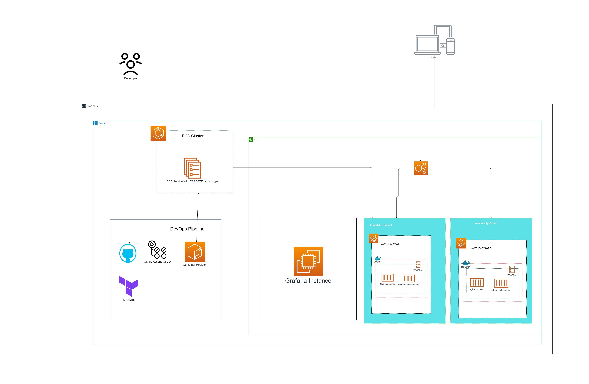
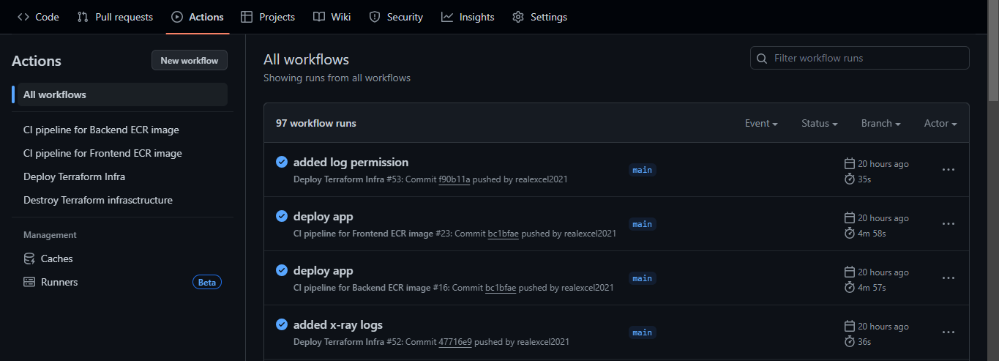
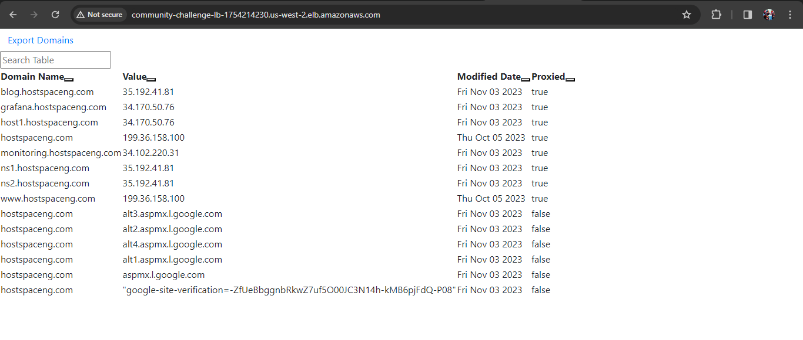
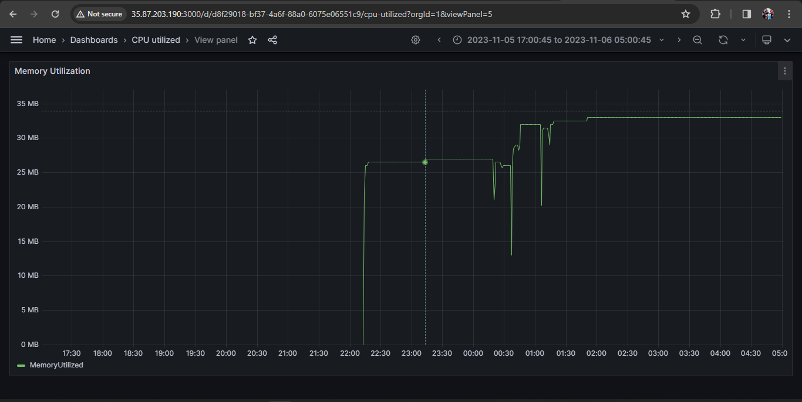
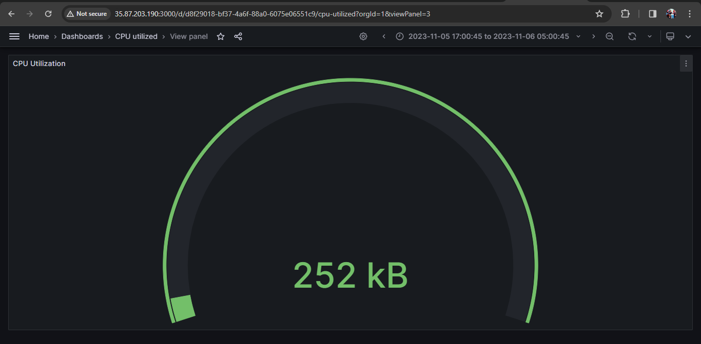
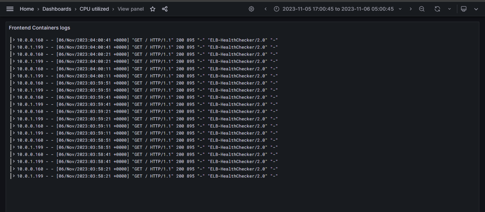

### Submission Pull Request Template

**Title:** [Submission] - [Sheriff Joe Excel]

**Description:**

Provide a detailed summary of the changes included in this submission. Explain the problem you aimed to solve, the solutions you implemented, and the results achieved. Include any challenges faced and how they were overcome.

The above diagram is the cloud architecture that was choosen to deploy the software provided. The application is a frontend UI and a proxy backend, the deployment is aimed to be on a containerized environment putting otgether DevOps practices, and these DevOps practices/culture of deploying this application is done on the cloud, Specifically AWS as the choosen Cloud provider.

Please see the readme of the proect to get a clear view on how to deploy the app.

The folder structure was changed and the code base was placed based on the specified purpose of the code base.
`/backend` contains the backend codebase `/frontend` containes the frontend code and finally `/terraform` contains the terraform deployment files.

The application provided and the deployment of this application on the cloud was a challenge and a given problem, the backend application also has certain API keys which should be treated as secrets in the deployment. One other problem is handling some form of scale and load balancing in the application, though it is a small one, managing these continerized application on the cloud also keeping good note of best security practices when deploying containers on the cloud, as we all know that containers are very insecure.

I was able to solve the problems stated above with the aid of the choosen architecture that is drafted in the basic diagam above. I experienced many challenges during the couurse of deploying this application, ranging from managing the secrets, collecting the logs from containers that were deployed in the private subnets, also handling automated terraform deployments using the CI/CD pipeline, and managing errors that could occur when configuring the AWS architecture.

Managing secrets within containers can be alot and mostly insecure. Based on the deployment strategy I choosed, I used the advantage of AWS services to pass the secret securely into the containers safely.

The containers were not sending logs to cloud watch as the central monitoring service because the containers were deployed on the private subnets of he VPC. The issue was resolved and was caused because of a configuration that I omitted in the task definition because i felt it was not neccesary because it creates a new log group when i already have one. (I learnt alot from this experience not to underate or leave out any configuration that comes from the Docs).

Many of my CI/CD pipeline failed and I spent alot of time debugging because when I write the terraform code locally, and I have no state file locally to even validate the code or check if there are any syntax errors I when writing the terraform configuration.
To resolve this, I implemented a strategy in the CI/CD pipeline with gihub actions, where whenever a change is made, I'll create a new branch for the new resources added in terraform, then make only a pull request. Now this pull request is configured with an actions bot that will automatically pick up the terraform code, validate it, then finally plan the code to confirm if the code will by any means work.

---

### Solution Details

**Dockerfile & Application Configuration:**
- Briefly describe how the Dockerfile was structured and how the application was configured, including any optimizations or specific configurations used.

The dockerfile for the backend was built using the latest alpine image that is more light weight, compresses and production optimized. It uses the python official image and uses the COPY command to send over files from the git repository over to the docker image during the build. The build runs github actions and then the pipeline pushes the built image over to ECR.

The frontend on the other hand, uses a multi-stage build. This build involves only two stages, one for the node js image that will build the code and packages it for production. The second stage is an nginx image which is what we will be using to serve the app. The nginx image is also the latest alpine image that is very light weight. The nginx image just copies over the static content and serves it.

**CI/CD Pipeline:**
- Explain the CI/CD pipeline’s flow, including the build, test, and deployment stages. Specify the tools and services used, and the reasons for choosing them.

In this project, there are 4 pipelines for certain steps in building and deploying the code.

The first pipeline, Deploys the Frontend Image. In github actions, it was configured to look for changes in the folder `/frontend`. If a change is detected in that specified folder, the pipeline starts. In the pipeline, the steps involes testing ---> build ---> push to ECR ---> update task definition --> deploy to ECS cluster. So whenever there is a push to the repository and the push contains a change in that `/frontend` directory, the pipeline then starts and the process happens. It takes the sha of the event and places it as the tag of the image in ECR. So if you were to revert back, it would pick up the sha of the prev commit and then update the task definition image.

The second pipeline, deploys the backend proxy application. It does this following same process with the frontend and looks for a change in the `/backend` folder. The process involves testing ---> build ---> push to ECR ---> update task definition --->  Deploy ECS cluster. 

The third pipeline, is for terraform. The pipeline looks for change in the `/terraform` folder then execute. the process involves configuring aws credentials --> initializing terraform ---> validate terraoform code ---> apply terraform code. This pipeline also looks for pull requests between branches in the repository that involves changes in the terraform code then initialize terraform ---> validate terraform ---> plan terraform the plan is the shown in the pull request written by the actions bot.

The fourth pipeline is also for terraform. But this time, this pipeline can only be triggered manually in the console. The pipeline destroys the terraform infra that has been provisioned. It remooves all the configurations that have been applied.

For this pipeline, I made use of Github actions, which was the recommended tool in the challenge, it was an eye opener to how managing of individual servers for CI/CD using jenkins was eliminated, I was totally free from the jenkins 403 error and plugin issues. Githubb actions for this tool works fine and is very efficient for the pipeline. Managing secrets is also safer and not as exposed not like jenkins.

**Infrastructure as Code (IaC):**
- Provide information on the IaC scripts or tools used for provisioning and deployment. Include details of the deployment platform or cloud service utilized.

For this deployment, I made use of terraform as my IaC script because of it's nature, wide acceptance and management. The codebase, make use of terraform modules, both local in the `/terraform/modules` folder and remotely from the official terraform modules source. The terraform code make use of variables to specify some crucial needs in the application that can be customized when deploying based on personal needs. The values of the variables declared, are passed in the `terraform.tfvars` file and can be edited based on specific needs for example if you want to change the vpc cidr block.

The deployment made use of ECS cluster with Fargate nodes. The cloud provider used for this deplooyment is AWS. 

**Monitoring Setup (Bonus):**
- If implemented, describe the monitoring tools and configurations used. Include any custom dashboards or alerts set up to track application and infrastructure health.

For monitoring, terraform creates an EC2 machine and in the installation details there is guide to install grafana on the machine. To get logs and matrices from grafana, the data source I used was cloudwatch. So cloud watch, aggregates the log from the containers using the container's log driver that was specified in the task definition.
The instance is attached to a role that provies it permissions to cloudwatch and logs so there is not need to configure AWS credentials in Grafana

I used grafana to get detailed logging and more deeper insights of the matices that come from cloudwatch

**Screenshots/Links (if applicable):**
- Include screenshots or links showcasing the deployed application, CI/CD pipelines, and monitoring dashboards.

CI/CD pipelines

Deployed Application

Grafana Monitoring

---

### Testing the Solution

Provide clear instructions on how the evaluators can test and verify your solution. Include steps to:

1. Clone your forked repository.
2. Build and run the application using the provided Dockerfile.
3. Deploy the application using the IaC scripts.
4. Access and test the application’s functionality.
5. View and analyze the monitoring dashboards.

---

### Additional Information

Include any other relevant information like:
- Challenges faced during the challenge and how they were overcome.
- Any improvements or features that could be added in the future.
- Feedback or comments on the challenge and your learning experience.

---

**Checklist:**
- [ * ] The submission follows the format specified in the challenge instructions.
- [ * ] The Dockerfile builds successfully and is optimized.
- [ * ] The CI/CD pipeline is complete and functional.
- [ * ] The IaC scripts are modular and reusable.
- [ * ] The README file is clear and comprehensive.
- [ * ] (Bonus) The monitoring setup is functional and comprehensive.

By submitting this pull request, I confirm that my contribution is made under the terms of the challenge’s requirements.
