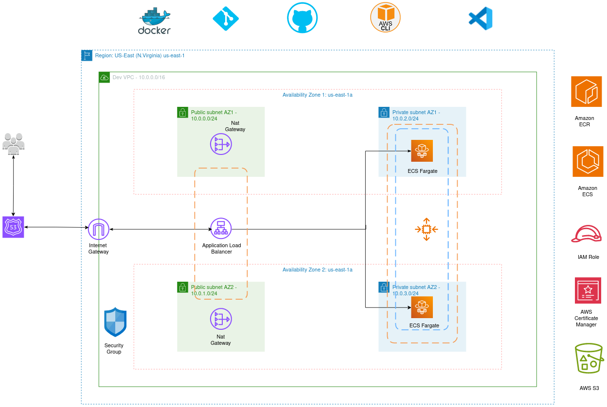

# Deployment of Cloudflare Domains Manager

Deploy and manage your domains with ease using the Cloudflare Domain Manager Application. This repository provides a step-by-step guide for deploying and running the application.




## Prerequisites

Before you begin, make sure you have the following prerequisites installed and set up on your system:
- **Code Editor**: We recommend using Visual Studio Code for code editing and customization. You can download it [here](https://code.visualstudio.com/).
- **Docker**: Ensure that you have Docker installed on your machine. You can download it [here](https://www.docker.com/get-started).

- **Git**: You'll need Git to clone this repository. If you don't have Git installed, you can get it [here](https://git-scm.com/).

- **Web Browser**: To access the application, you'll need a modern web browser.
- **AWS Account**: You should have an AWS account with the necessary permissions to create and manage AWS resources. (To deploy on cloud)
- **GitHub Account**: You'll need a GitHub account to access this repository and set up GitHub Actions. If you don't have one, you can create an account [here](https://github.com/join).

## Setup & Installation

To deploy the Cloudflare Domain Manager Application, follow these simple steps:

#### 1. For local setup:

##### a. Clone the Repository

Clone the repository from [https://github.com/hostspaceng/community-challenge](https://github.com/hostspaceng/community-challenge).

```shell
git clone https://github.com/hostspaceng/community-challenge.git
cd community-challenge
```
##### b. Build the Docker Container
```shell
docker build -t cloudflare-app .
```
##### c. Run the Application image using Docker command

```bash
docker run -d -p 80:80 -p 5000:5000 cloudflare-app
```
#### 2. To deploy on AWS

##### a. Clone the Repository

Clone the repository from [https://github.com/hostspaceng/community-challenge](https://github.com/hostspaceng/community-challenge).

```shell
git clone https://github.com/hostspaceng/community-challenge.git
cd community-challenge
```

Clone the repository from [https://github.com/hostspaceng/community-challenge](https://github.com/hostspaceng/community-challenge).
##### b. Set Up AWS Credentials: 
Configure your AWS credentials by setting the AWS_ACCESS_KEY_ID and AWS_SECRET_ACCESS_KEY as GitHub secrets. These secrets are required for the GitHub Actions workflow to interact with AWS.

##### c. Configure the GitHub Account and GitHub Action Workflow: 
Open the .github/workflows/deploy-pipeline.yaml file and customize it to match your AWS resources. Check the environment variables and secrets, edit them to suite your requirements.

##### d. Commit and Push Changes: 
Commit your changes and push them to the repository.

##### e. GitHub Action Workflow: 
The GitHub Action workflow for AWS deployment will be triggered automatically. It will create the required infrastructure on AWS, build the Docker container, and deploy the application.

##### f. Access the Application: 
Once the workflow is completed, you can access the application through your web browser using the provided domain name.

##### Customizing the Infrastructure as Code (IaC)

The iac directory contains the Terraform scripts for provisioning AWS resources. You can customize these scripts to match your specific requirements. Refer to the Terraform documentation for more details on how to modify the infrastructure configuration.

##### Continuous Deployment

I set up an end-to-end GitHub Action CI/CD pipeline for this application. With each push to this repository after specifying the terraform action you want to perform in the environment variable, the latest changes are automatically deployed to the production server.
## Participation in the Challenge

For details on participating in the challenge, including writing a Dockerfile, setting up a CI/CD pipeline, and implementing Infrastructure as Code (IaC), please refer to the detailed challenge instructions provided.

Make sure to use the provided pull request template when submitting your solutions to facilitate a uniform and organized evaluation process.

For any questions or clarifications, reach out on the dedicated Slack channel. Happy coding!
