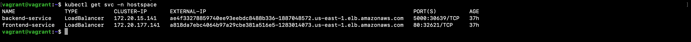
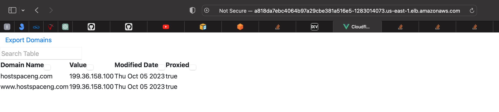
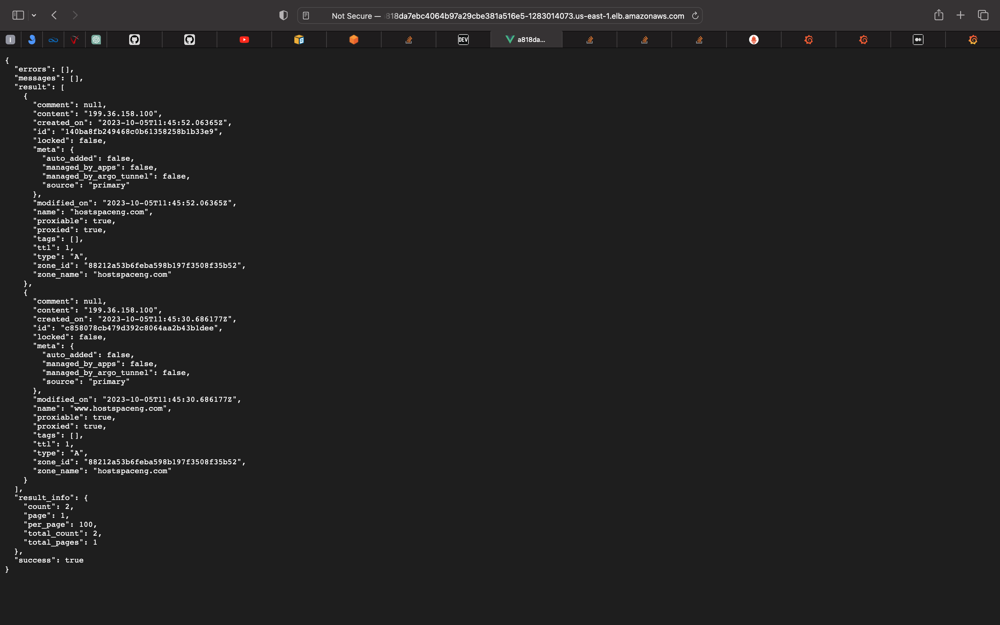
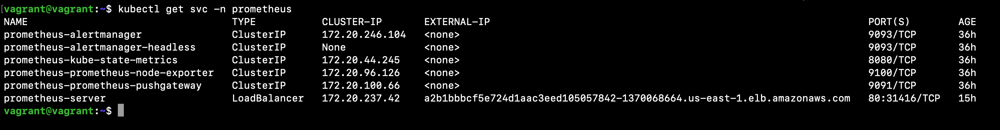
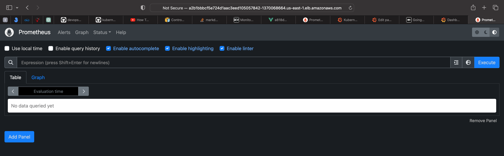
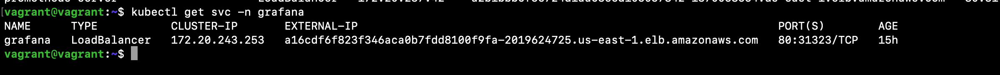
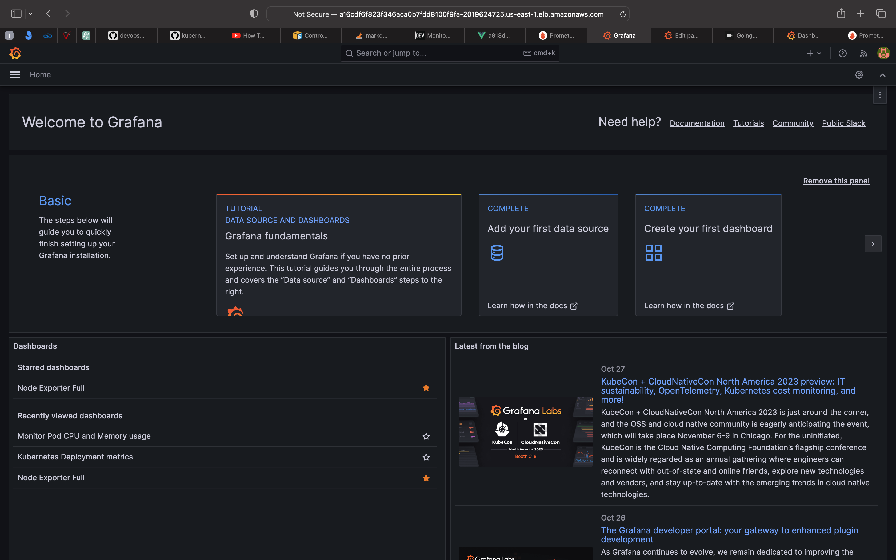
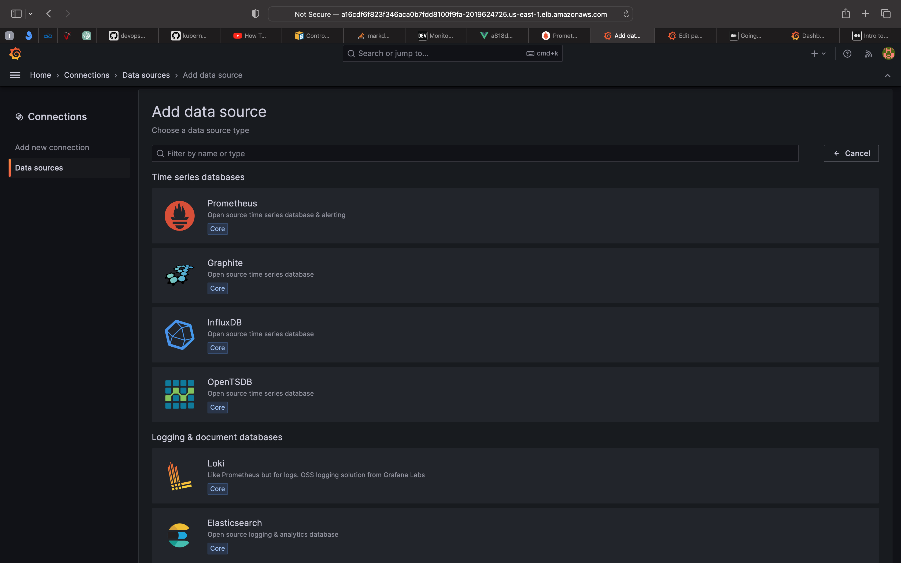
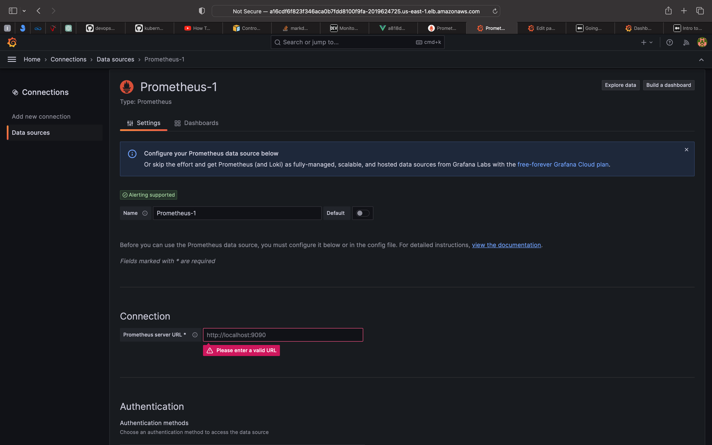
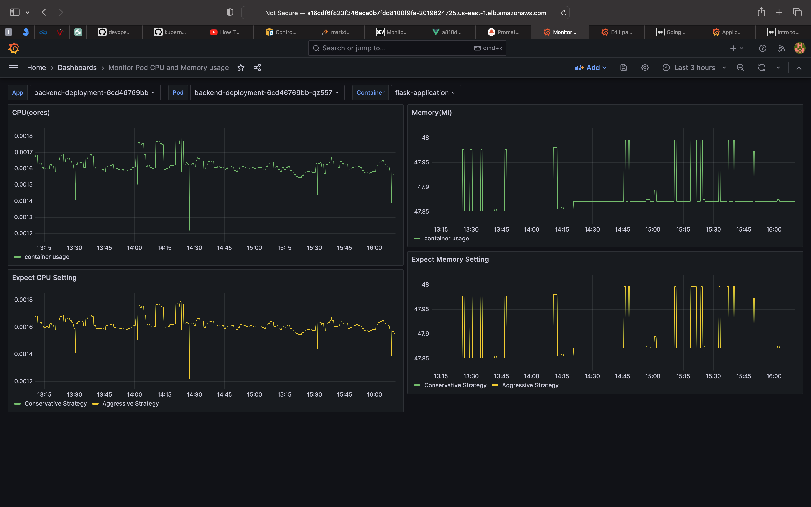

# Cloudflare Domains Manager

Manage your Cloudflare domains with ease using the Cloudflare Domains Manager. This responsive and efficient application is built with a Vue.js frontend and a Python Flask backend. 


## Setup & Installation(Local Machine)

### Prerequisites

The applications are deployed using docker compose locally. Ensure the following prerequisite is installed on your local machine:

### Backend and Frontend
- Docker
- Docker Compose

Follow these instructions to set up the development environment on your local machine.

### 1. Clone the Repository

Clone the repository from https://github.com/Okeybukks/community-challenge.git .

```bash
git clone https://github.com/Okeybukks/community-challenge.git
cd community-challenge
```

### 2. Machine Setup

The test environment I used is Ubuntu 20.04.6 LTS. Whatever machine is used, ensure you have docker and docker compose installed by running this command.

```
docker version
docker compose version
```

#### Set Environment Variables

Replace the placeholders in the `.env` sample file with your actual Cloudflare credentials and configurations or copy from  `.env.sample`. To use the environment file during the deployment with docker, rememeber to rename to `.env`.

```plaintext
ZONE_ID=your_zone_id_here
CF_API_KEY=your_CF_API_KEY_here
CF_API_EMAIL=your_CF_API_EMAIL_here
VUE_APP_PROXY_URL=IP_ADDRESS_OF_MACHINE
```

For my test environment, the IP of the Linux machine is 192.168.56.28

#### Start the Application

```bash
docker compose -f dockercompose.yaml up
```
The command builds the docker images specified in the dockercompose.yaml file and the starts up the application.

If you want to only build the application images only with out starting the applications, run this command.

```bash
docker compose -f dockercompose.yaml build
```

The above command creates two images; the Vue application and Flask application. You can see the created docker images using this command.

```bash
docker images
```
Because the application is served using Nginx, the Flask API server will be running on [http://IP/proxy/](http://IP/proxy/).

In my case, the Flask API is running on [http://192.168.56.28/proxy/](http://192.168.56.28/proxy/). The Falsk application is also running on [http://192.168.56.28:5000](http://192.168.56.28:5000)

The Vue application is runing on [http://IP](http://IP), In my case, the Flask API is running on [http://192.168.56.28](http://192.168.56.28) 

## Setup & Installation(Deploying to the Cloud)
### Prerequisites

The applications deployment is down in the cloud. The following prerequisite are needed to completely deploy to the cloud.

#### CICD Tool
- Jenkins

### IAC Tool
- Pulumi

#### Cloud Infrastructure
- AWS Account

## Infrastructure creation using Pulumi
For this project, we employed Pulumi to build the infrastructure. Pulumi is an Infrastructure as Code (IaC) tool that empowers the utilization of widely-used programming languages to orchestrate cloud resources. In this project, I am utilizing Python as our programming language for resource provisioning. The specific resource I am creating is an Amazon Elastic Kubernetes Service (EKS) cluster.

To get started with Pulumi, check out this [link](https://www.pulumi.com/docs/clouds/aws/get-started/).

### Setting AWS Credentials
Programmatic access is need by Pulumi to create resources in your cloud platform. This access is granted using Access keys. If you don't have one you can check out this [article](https://docs.aws.amazon.com/IAM/latest/UserGuide/id_root-user_manage_add-key.html) no how to create one.

Pulumi checks the `.aws/credentials` file for the access key. This should be how your `.aws/credentials` look like.
```
[default]
aws_access_key_id = YOUR ACCESS KEY ID
aws_secret_access_key = YOUR ACCESS KEY ID
region = YOUR REGION
```

### Building EKS Cluster
- Change into the my-k8s-cluster.

    ```
    cd my-k8s-cluster
    ```
- Edit the `Pulumi.dev.yaml` file to your cluster requirements and region you wish to deploy to.
- Run the command below to start the cluster creation.
    ```
    pulumi up
    ```

### Configuring the Cluster
The `kubectl` command requires `KUBECONFIG` pointing to the cluster's configuration for it to run without errors. To get the configuration of the created cluster run this command.
```
pulumi stack output kubeconfig > kubeconfig.json
```
In order to avoid preceding every `kubectl` command with `KUBECONFIG=./kubeconfig.json` before running, add the cluster configuration to the default kubernetes configuration file.
```
kubectl config view --minify --flatten --context=aws --kubeconfig=kubeconfig.json >> ~/.kube/config
```
The above command assumes `kubectl` is installed if not check out this [link](https://kubernetes.io/docs/tasks/tools/install-kubectl-linux/) on how to go about it.

To confirm if there are nodes in your cluster, run this command.
```
kubectl get nodes
```
## Application Deployment

The following deployment files were created for the application to be deployed in the kubernetes cluster.

- secrets.yaml file: This file conatins the value of the `CF_API_KEY` variable. The `CF_API_KEY` value is first encrypted before being added as data to the file. This command is used for the encryption.
   ```
   echo -n CF_API_KEY | base64 -w 0
   ```
   Run the `kubectl create -f secrets.yaml` command to create the secret resource.

- configmap.yaml: This file is used to store the environment variables needed by the flask application. The variables are `CF_API_EMAIL`, `VUE_APP_PROXY_URL` and `ZONE_ID`

   Run the `kubectl create -f configmap.yaml` command to create the configmap resource.

- namespace.yaml: This file is used to create a different namespace from the default namespace. This is used for proper resource organization.

   Run the `kubectl create -f namespace.yaml` command to create the namespace resource.
- backend-service.yaml: This file is used to create the backend service used to reach the pods deployed to serve the flask app.

   Run the `kubectl create -f backend-service.yaml` command to create the backend-service resource.

- backend-deployment.yaml: This is the file responsible for creation of the flask app pods.

   Run the `kubectl create -f backend-deployment.yaml` command to create the backend-deployment resource.

- frontend-service.yaml: The service needed to reach the vue application and also expose to the internet is created using this file.

   Run the `kubectl create -f frontend-service.yaml` command to create the frontend-service resource.

- frontend-deployment.yaml: The vue application pods are created with this file.

   Run the `kubectl create -f frontend-deployment.yaml` command to create the frontend-deployment resource.

To see the created resources, run this command;

```
kubectl get all -n hostspace
```

The application can be reached with the url in the `EXTERNAL-IP ` of the services table. The frontend-service type is `LoadBalancer`, a load blancer resource will be created in AWS whenever the frontend-service is created in kubernetes.

Once deployed to get the URL of the applications run this command `kubectl get svc -n hostspace`, you should get something similar to this;



In  my case, URL of the frontend application  is `a818da7ebc4064b97a29cbe381a516e5-1283014073.us-east-1.elb.amazonaws.com`
and to get the API of the flask application, just append `/proxy` to the above URL.

Remember this URL will definitely be different from what you will get, also it might not be available again in the future because I will eventually destroy the created resources.

This is a screenshot of my applications working with the above URL.





## Application and Cluster Monitoring
The EKS Cluster and applications deployed to the clusters are monitored using prometheus and grafana. Both prometheus and grafana have good documentations to integrate into the kubernetes cluster.

### Prometheus Deployment
To integrate prometheus in your EKS cluster, checkout this well detailed [article](https://docs.aws.amazon.com/eks/latest/userguide/prometheus.html). With this article, when you run the `kubectl get all -n prometheus`, you will notice the `prometheus-server` deployment is stuck at `pending`, the reason is because a `persistent volume` has not be created which is needed by the `prometheus-server` deployment. To create the `persistent volume`, you have to configure the `aws-ebs-csi-driver
` for that. Checkout this [link](https://docs.aws.amazon.com/eks/latest/userguide/ebs-csi.html) on how to go about it.

The default prometheus service has a type `ClusterIP`, to make it accessible to the public, this service type has to change be changed to a `LoadBalancer` or `NodePort`.

First delete the created prometheus service.

```
kubectl delete svc prometheus-server -n prometheus 
```

Then run this command to create a new prometheus service

```
kubectl create -f prometheus-service.yaml
```
Remember, for this command to work, you must be in the `/kube_files` folder. The new prometheus service creates a new AWS loadbalancer whose URL is used to access the promethues server.

```
kubectl get svc -n promethues
```
The above commands returns the prometheus URL of the prometheus service.




### Grafana Deployment
Grafana is the visualization tool used to visualize metrics gotten by prometheus. The deployment file for grafana is located in the `/kube_files` folder.

To deploy grafana run `kubectl create -f grafana.yaml`.

The deployed resources can be found using the `kubectl get all -n grafana` command. The grafana service created has a `LoadBalancer` type, so an AWS loadbalancer is created whose URL is used to access the grafana service.





To build dashboards to visualize various metrics, prometheus has to be added as a data source. The `prometheus-server` URL is used as the data source. Put URL in `Prometheus server URL *` of grafana.





The following dashboards where created for the kubernetes cluster and application monitoring.

- Node Exporter: This dashboard gets the CPU, Memory, Network Traffic, Storage Disk Usage of each node in the cluster.

  

- Monitor Pod CPU and Memory usage: This dashboard is used to monitor the CPU and Memory usage of the applications in the pods in the kubernetes cluster. Select the pod in the pod menu and it displays information graphs on it.

  
- Kubernetes Deployment metrics: This dashboard returns the number of deployments, the deployments available, each memory and CPU usage of each deployments.

   

