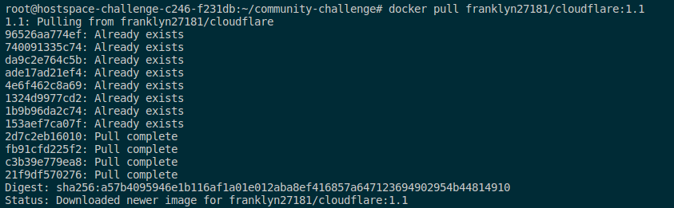
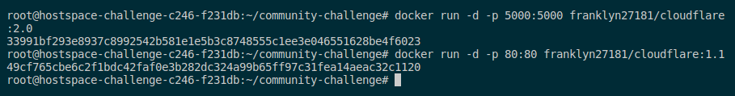

# Cloudflare Domains Manager
Cloudflare is a large network of servers that can improve the security, performance and, reliability of anything connected to the internet. 

Manage your Cloudflare domains with ease using the Cloudflare Domains Manager. This responsive and efficient application is built with a Vue.js frontend and a Python Flask backend.


This respository contain a Dockerfile to build and run the application in a docker container and a civo kubernetes cluster for running the application in a production environment.


## Prerequisites

Ensure the following prerequisites are installed on your machine:

### Container

- Docker

### IaC

- Terraform

### Orchestration tool

- Kubernetes

## To get started:

### 1. Cloning the repository: 

Fork and clone [this repository](https://github.com/Franklyn-dotcom/community-challenge)

``` git clone https://github.com/Franklyn-dotcom/community-challenge.git ```

### 2. Change the directory into your cloned repo:

```cd community-challenge```


#### 3. Set Environment Variables:

Rename and Replace the placeholders in the `.env.sample` to `.env` file with your actual Cloudflare credentials and configurations.

``` 
ZONE_ID=your_zone_id_here
CF_API_KEY=your_CF_API_KEY_here
CF_API_EMAIL=your_CF_API_EMAIL_here
VUE_APP_PROXY_URL=IP_ADDRESS_OF_YOUR_MACHINE 
```

### 4. Creating the Dockerfile
We will be creating a single [Dockerfile](./Dockerfile) to build the backend, frontend and nginx image to ensure Nginx is set up to serve the bundled Vue.js application and also route traffic to the Python Flask proxy accessible at `"/proxy/"`.

Copy and paste the following code into your Dockerfile:
```
# # Pulling a secured python image and using as our base image
FROM python:3.10-alpine as api
LABEL maintainer="Mbanugo mbanugofranklyn678@gmail.com"

# # change to the working directory 
WORKDIR /app

# # copy only the requirements file to cache dependencies
COPY requirements.txt .

# # installing the required dependencies
RUN pip install -r requirements.txt

# #set the working directory
COPY . .

# # set environmental variable for flask 
ENV FLASK_APP=main.py


# # expose the application on port 5000
EXPOSE 5000

CMD [ "flask", "run", "--host=0.0.0.0" ]


# create another base image for frontend application
FROM node:lts-alpine as web

# make the 'app' folder the current working directory
WORKDIR /app


# copy both 'package.json' and 'package-lock.json'
COPY package*.json ./

# install project dependencies
RUN npm install

# copy the all files and folders to the current directory
COPY . .


# run the application development
RUN npm run build


# another base image to route traffic to both the frontend and backend application
FROM nginx:alpine

# change to the working directoy
WORKDIR /app

# copy the frontend b
COPY --from=web /app/dist /app/dist

# remove the default nginx configuration file
RUN rm /etc/nginx/conf.d/default.conf

# copy new nginx.conf to the nginx directory
COPY nginx.conf /etc/nginx/conf.d/

# expose application on port 80
EXPOSE 80

# run the nginx application
CMD ["nginx", "-g", "daemon off;"]

```

### 5. Building and Pushing the docker image to docker hub using github actions 

After saving your Dockerfile, we will building and pushing the docker image using github actions. 

Check out [introduction to github actions](https://www.telerik.com/blogs/introduction-github-actions) to learn more about github actions.

(i) Create a `.github/workflows` directory

``` mkdir .github/workflows ```

(ii) Cd into the directory

``` cd .github/workflows ```

(iii) Create a main.yml file to store your workflow:

``` touch main.yml ```

You will need to create the credentials for the docker hub to enable you to push the image to docker hub or any private respository of your choice

(iv) Naviagte to your repository, Click on the `settings` and click on the `Secrets and Variables`


Then click on `Actions` 


You can see, I have already created a secret to store my dockerhub username and password. 

To store your dockerhub or any private repository of your choice, click on the `New repository secret`


Replace the `YOUR_VARIABLE_NAME` with docker hub or your private repository.

In the `Secret` area, replace the `YOUR_DOCKER_USERNAME` with the username of your docker hub or your private repository username.

Click on the `Add secret` to save the secret.


We will repeat the same thing for the password


Replace the `YOUR_VARIABLE_NAME` with docker hub or your private repository.

In the `Secret` area, replace the `YOUR_DOCKERHUB_PASSWORD` with the username of your docker hub or your private repository username.

Click on the `Add secret` to save the secret.

You have successfully created your secrets to store your private repository credential!. 


(v) Copy and paste the following code into the `main.yml`

```
name: continuous integration

on:
  push:
    branches:
      - "main"

jobs:
  build:
    runs-on: ubuntu-latest
    steps:
      -
        name: Checkout
        uses: actions/checkout@v3
      -
        name: Login to Docker Hub
        uses: docker/login-action@v3
        with:
          username: ${{ secrets.DOCKERHUB_USERNAME }}
          password: ${{ secrets.DOCKERHUB_TOKEN }}

      -
        name: Build and push docker image for the backend
        uses: docker/build-push-action@v5
        with:
          context: .
          file: ./Dockerfile
          push: true
          tags: ${{ secrets.DOCKERHUB_USERNAME }}/cloudflare:2.0
          target: api
      -
        name: Build and push docker image for the frontend
        uses: docker/build-push-action@v5
        with:
          context: .
          file: ./Dockerfile
          push: true
          tags: ${{ secrets.DOCKERHUB_USERNAME }}/cloudflare:2.1
```

Replace the `${{ secrets.DOCKERHUB_USERNAME }}` and `${{ secrets.DOCKERHUB_TOKEN }}` with your own environment variable you saved in the `Action` page.

Once you are done adding the script and credentials, you need to git add, commit and push the file to your repo.


The workflow will be triggered in the response to your push event you created in your file.

``` 
on:
  push:
    branches:
      - "main"

```

To see your running workflow action, navigate to the Actions page, you can see the build running with the git commit message. To see the build running click on the git commit message. You can see, in my Actions my running commit message is `update files`


click on your running build, you will find the name of your job which you used in the `main.yml` file. 

```
jobs:
  build: # using the build as a reference to the name of the job  
    runs-on: ubuntu-latest
    steps:
```


Click on the <b>build</b>, you will find all your running jobs for your workflow.


Now, you have succesfully build and push your docker image to private repository using continuous integration with github actions.


### 6. Pulling and running the docker image locally

In this step, we will be pulling and running our application locally using the `docker run` command.

run this command to pull your docker image from your private repository:

```
docker pull franklyn27181/cloudflare:2.0

docker pull franklyn27181/cloudflare:2.1

```
Replace the `franklyn27181/cloudflare:2.1 and franklyn27181/cloudflare:2.0` with your image name and tag.

You should see an output like this:




To view your docker image use the command below:

`docker images`

run the following command to run your docker image:

```
docker run -d -p 5000:5000 franklyn27181/cloudflare:2.0

docker run -d -p 80:80 franklyn27181/cloudflare:2.1
```




The container will run in detach mode using your built image.The backend container will be running on port 5000 and the frontend container will be running on port 80 or just using the url.

You can access your container on the web page using your ip address and the port you are using to run your containers. Like this:

`http://YOUR_IP_ADDRESS:5000` 


`http://YOUR_IP_ADDRESS`

i will be using `http://192.168.0.120/` to run the containers.


You should see an output like this:


### 7. Automating the Kubernetes cluster using terraform

We will be automating our kubernetes cluster using terraform. We will using civo provider to manage the clusters. You can use any cloud provider of your choice.

(i) Create a `Iac` directory 
```
mkdir IaC
```

(ii) Change directory to the Iac directory
```
cd IaC
```

(iii) Create a `provider.tf` and `civo.tf` file. `The provider.tf` will be used to manage your provider infrastructure and the `civo.tf` will be used to automate your cluster.

```
touch provider.tf && touch main.tf
```

copy and paste the following code into your `provider.tf` and `civo.tf` file 

```
nano provider.tf # this command opens the file in an editor
```

```
terraform {
  required_providers {
    civo = {
      source = "civo/civo"
      version = "1.0.39"
    }
  }
}

provider "civo" {
  token = var.civo_token
  region = "FRA1"
}

```

Save the file.

Copy and paste the following code into your `civo.tf` file

```
nano main.tf
```


```
# Query small instance size
data "civo_size" "xsmall" {
    filter {
        key = "type"
        values = ["kubernetes"]
    }

}


# Create a firewall
resource "civo_firewall" "my-firewall" {
    name = "my-firewall"
    
}

# Create a firewall rule
resource "civo_firewall_rule" "kubernetes_api" {
    firewall_id = civo_firewall.my-firewall.id
    protocol = "tcp"
    start_port = "6443"
    end_port = "6443"
    cidr = ["0.0.0.0/0"]
    direction = "ingress"
    label = "kubernetes-api-server"
    action = "allow"
}


# Create a cluster with k3s
resource "civo_kubernetes_cluster" "k8s_demo_1" {
    name = "k8s_demo_1"
    applications = ""
    firewall_id = civo_firewall.my-firewall.id
    cluster_type = "k3s"
    pools {
        size = element(data.civo_size.xsmall.sizes, 0).name
        node_count = 3
    }
}

```

After adding the files, save the file and exit the editor using `ctrl + o ` to save and `ctrl + x` to exit. 

Run the following commands:

`terraform init` To initialize your files and provider

`terraform plan` To see your resources that are being created 

`terraform apply` To apply the resources


You have successfully created your Kubernetes cluster. Next, we will be automating the kubernetes file to deploy the application to a LoadBalancer.

